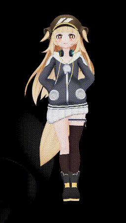

# Liqu Desktop Companion

A transparent, always-on-top 3D desktop companion built with **Electron** and **three.js + [@pixiv/three-vrm](https://github.com/pixiv/three-vrm)**. A VRM character floats above your windows, animates naturally, reacts to your cursor, can walk around your screen, and can talk with you by text or voice through your choice of AI provider — including a fully offline option.

<table align="center"><tr>
<td></td>
<td></td>
</tr></table>

> Bring your own VRM model and (optionally) an AI API key or a local Ollama install.

## Features

**Character & animation**
- Supports **VRM, GLTF/GLB, FBX, and OBJ** model formats — drop any of them in directly or inside a zip
- VRM models get full support: expressions, eye tracking, spring-bone wind, blend shapes
- Other formats load, render, and auto-frame correctly; VRM-specific features gracefully degrade
- Frameless, transparent, always-on-top window
- Natural procedural animation: layered breathing, weight shifting, per-bone follow-through, and quaternion-based pose blending (no rigid snapping)
- 28 selectable poses/behaviors (wave, sit, dance, think, stretch, walk, and more)
- Constant turbulent wind on hair/cloth physics, with a stronger gust pose
- Eyes track your cursor independently of the head
- Blinking, expressions, and a brief surprised reaction when you poke the character
- Auto-sleep when idle; idle variation so it never loops one motion
- Drag the character (or the handle) to move it anywhere

**Movement**
- **Wander** — roams between screen edges on its own
- **Follow the cursor** — walks after your mouse
- **Come here** — walks to your cursor once
- Edge-snapping when you drop it near a screen border

**AI & voice**
- Chat by text or voice (mic button)
- Providers: **Anthropic (Claude)**, **OpenAI (GPT)**, **Google (Gemini)**, and **Ollama** (local, offline, free)
- Model field auto-fills a sensible default per provider, with a dropdown of common models
- Optional persistent memory across restarts
- Optional real API TTS (OpenAI / ElevenLabs) with amplitude-based lip-sync
- Optional vision: the character can look at your screen and react

**System**
- Global hotkey `Alt+Shift+L` to show/hide
- Open on system startup
- Optional clipboard-context and CPU-load awareness
- "Hide everything but the character" mode
- Settings persist across restarts

A built-in **Help** tab inside the app lists where to get API keys and VRM models.

## Quick start

Requires [Node.js](https://nodejs.org) 18+.

```bash
git clone https://github.com/CameronCodesStuff/liqu-companion.git
cd liqu-companion
npm install
npm start
```

Or, with no terminal:
- **Windows:** double-click `start.bat`
- **macOS / Linux:** double-click / run `start.sh`

The first run installs dependencies automatically.

## Adding a character

Open **Settings → Appearance** and drop a `.zip` containing a `.vrm` file onto the import box (or click to browse). Imported characters are stored in your user-data folder and can be renamed or deleted in-app.

Where to find free VRM models:
- [VRoid Hub](https://hub.vroid.com) — many free models (check each license)
- [VRoid Studio](https://vroid.com/en/studio) — make your own
- [Booth.pm](https://booth.pm) — search 無料 (free)

## Setting up AI

Open **Settings → AI**, pick a provider, and paste an API key:

| Provider | Get a key at |
| --- | --- |
| Anthropic (Claude) | [console.anthropic.com](https://console.anthropic.com) |
| OpenAI (GPT) | [platform.openai.com](https://platform.openai.com) |
| Google (Gemini) | [aistudio.google.com](https://aistudio.google.com) |
| ElevenLabs (voice) | [elevenlabs.io](https://elevenlabs.io) |

### Offline & free (Ollama)

1. Install [Ollama](https://ollama.com).
2. Pull a model: `ollama pull llama3.2` (or `llama3.2-vision` for the vision feature).
3. In the AI tab, choose **Ollama**, confirm the URL, and click **Test**.

No API key required — runs fully local and private.

Keys are stored locally via `electron-store` in your OS user-data folder, in plain form — suitable for a personal machine, not a hardened secrets vault.

## Building installers

```bash
npm run dist        # current platform
npm run dist:win    # Windows installer (.exe, NSIS)
npm run dist:mac    # macOS .dmg
npm run dist:linux  # Linux AppImage / .deb
```

The Windows build is a full setup wizard (choose install folder, shortcuts, run-on-finish) and registers an uninstaller in **Add or Remove Programs**. Replace the placeholder icons in `assets/icons/` with your own before a real release.

> Building a `.exe` requires Windows; a `.dmg` requires macOS. Code-signing requires your own developer certificate and is not configured here.

## Project structure

```
liqu-companion/
├── package.json
├── start.bat / start.sh            # one-click launchers
├── build-installer.bat / .sh       # build native installers
├── src/
│   ├── main.js                     # Electron main: window, tray, movement, AI proxy, IPC
│   ├── preload.js                  # secure context bridge
│   └── renderer/
│       ├── index.html
│       ├── style.css
│       └── companion.js            # three.js scene, animation, AI/voice, UI
└── assets/
    ├── model/                      # bundled VRM
    └── icons/                      # app + tray icons
```

## Tech

Electron · three.js · @pixiv/three-vrm · electron-store · JSZip. `three`, `three-vrm`, and `jszip` load via an import map from a CDN, so first run needs an internet connection; bundle them locally (esbuild/Vite) for a fully offline build.

## Notes & limitations

- Pose values target a standard VRM humanoid rig; unusual rigs may need tuning (see the pose definitions in `companion.js`).
- Voice input uses the browser's built-in speech recognition (online), not a bundled offline model.
- Real amplitude lip-sync requires API TTS; otherwise mouth movement is approximated from word timing.

## License

Code: see repository. Bundled VRM models retain their original creators' licenses — see `LICENSE-MODEL/`.
